## 💎 💎 💎 <span style="color:#c94d68"> Elhaj </span> 💎 💎 💎
* before we go through the wheel account I highly recommend you to read [this](./will.md)
# WillAccount:

**Disclaimer**: The concept of the `Will` smart contract is not a new one, and I want to clarify that I've been contemplating and develop a version of it for around 8 months. An early version of this concept can be found on my GitHub repository [here](https://github.com/elhajin/WillSmartContract).now with zksync account abstraction It make it really practical.

## **Table of Contents**:

- [intro to account abstraction](#intro-to-account-abstraction-on-zksyncera).
- [tips you should know about zksync](#tips-about-zksync-you-should-know).
- [transaction life cycle on zksync](#transaction-life-cycle-in-zksync).
- [the default account](#the-default-account-eoa-in-zksync).
- [account abstraction with Will mode](#account-abstraction-with-will-mode).
  - [will overview](#willmode-overview).
  - [implement Will ](#how-an-account-implements-a-will-feature).
- [function signatures are unique](#function-signatures-are-unique).
  - [function signatures will](#function-signatures-of-the-will-contract).
  - [function signatures willAccount](#function-signatures-of-willaccount-contract).
- [testnet](#deploy-interact-and-run-tests).
  - [deploy to testnet](#deploy-contracts)
  - [interact with account](#interact-with-account)
  - [run foundry tests](#run-tests-with-foundry).
  - [run hardhat tests](#run-hardhat-tests).

## **intro to account abstraction on ZksyncEra**

_Account abstruction in [zksync](https://zksync.io/) is Inspired by [ERC4337](https://eips.ethereum.org/EIPS/eip-4337). It's natively implemented in the protocol which make it really practical to improve user experience_ </br>

> in this article i'm assuming that you are aware of the [ERC4337](https://eips.ethereum.org/EIPS/eip-4337) or at least you have an idea about it's core concepts.

- First Let's get to know some of the basic concepts that we should know about `Zksync` and it's account abstraction.

## **tips about zkSync you should know**

- 1️⃣ **_in `zksync` all [accounts](https://ethereum.org/en/developers/docs/accounts/) are smart contracts_** : that's simply mean even the [EOA](https://ethereum.org/en/glossary/#eoa) is also a smart contract, which called [defaultAccount](#the-default-account-eoa-in-zksync),and it's a contract that simulate the behavior of [EOA](https://ethereum.org/en/glossary/#eoa) (`E`xternally `O`wned `A`ccount) to behave like an [EOA](https://ethereum.org/en/glossary/#eoa) on ethereum.
- 2️⃣ **[Bootleader](https://era.zksync.io/docs/reference/architecture/system-contracts.html#bootloader) system contract🥼** :the bootlear is a system contract that do a **lot**, but it's not deployed and can't be called. _Confusing right_ 😕😖 .</br>
  Well you can think about it as the [entryPoint](https://medium.com/edennetwork/erc-4337-exploring-the-technical-components-of-account-abstraction-part-2-fec300a7f052) contract in ERC 4337.and in the case of account abstraction it hundle the validating and the execution process of transactions.
- 3️⃣ **[System Contracts](https://era.zksync.io/docs/reference/architecture/system-contracts.html#executorfacet)** : While most basic EVM opcodes are supported as-is (such as zero-value calls, memory/storage management, arithmetic operations, etc.), certain opcodes aren't inherently supported by the VM. Instead, they're implemented using specialized `system contracts`.These contracts reside in a unique address range (0 to 2^16-1) and possess distinct privileges not found in regular user contracts(**like some have the ability to set the _msg.sender_**) and this contracts are deployed on the `Genesis block` .

## **transaction life cycle in zksync**

_One of the misconception concepts is the transaction flow ,how exactly a [Transactions](https://era.zksync.io/docs/reference/concepts/transactions.html) get :</br> **`created`** => **`sent`** => **`validated`** => **`executed`**._

> This may seem a basic concept but it was a problem that made me struggle to understand account abstraction just because i misunderstood it.so i'll try to cover the transaction life cycle in zksync from The beginning of the beginning.

This section provides a comprehensive breakdown of the transaction lifecycle in the zkSync protocol. It outlines the journey of a transaction, starting from initiation in a user's browser to its completion, including the role of operators and the [Bootleader](https://era.zksync.io/docs/reference/architecture/system-contracts.html#bootloader) contract.

### Step 1: User Initiates a Transaction

1. The process commences as the user interacts with a wallet interface, typically via a web browser or a mobile app.
2. The user selects a specific action, such as sending ETH or interacting with a smart contract .
3. The wallet constructs a transaction request based on the user's action and collects the necessary inputs. then use them to build the `transaction body`.

> **transaction body in zksync\_** :

```.sol
/// @notice Structure used to represent zkSync transaction.
struct Transaction {
  uint256 txType;
  uint256 from;
  uint256 to;
  uint256 gasLimit;
  uint256 gasPerPubdataByteLimit;
  uint256 maxFeePerGas;
  uint256 maxPriorityFeePerGas;
  uint256 paymaster;
  uint256 nonce;
  uint256 value;
  uint256[4] reserved;
  bytes data;
  bytes signature;
  bytes32[] factoryDeps;
  bytes paymasterInput;
  bytes reservedDynamic;
}
```

### Step 2: Transaction Request Creation and Signing

1. Upon confirming the transaction, the wallet generates a transaction object depends on the inputs provided by user.
2. In case of an `EOA` the transaction is gets signed by the user private key . in the `AA` case the signature can be any thing . or it maybe no signature at all . since the validation step is happens in the `validateTransaction()` function that can have any logic with some [limitation](https://era.zksync.io/docs/reference/concepts/account-abstraction.html#limitations-of-the-verification-step) which we will cover bellow.

### Step 3: Transaction Propagation

1. The signed transaction is broadcasted across the zkSync network. This dissemination is achieved by sending the transaction data to zkSync operators (machine running zkSync software).
2. Upon entering the mempool, transactions are aggregated by operators into bundles, each containing multiple transactions.

### Step 4: Transaction Validation and Bundling

1. These transaction bundles(blocks) are sent to the [Bootleader](https://era.zksync.io/docs/reference/architecture/system-contracts.html#bootloader) contract.
2. The [Bootleader](https://era.zksync.io/docs/reference/architecture/system-contracts.html#bootloader) contract manages the orchestration of transaction validationand execution .and excute the transactions one by one .

### Step 5: Validation and Execution by [Bootleader](https://era.zksync.io/docs/reference/architecture/system-contracts.html#bootloader)

1. The [Bootleader](https://era.zksync.io/docs/reference/architecture/system-contracts.html#bootloader) contract handles the validation of transactions within a bundle.</br>
   _The validation process includes:_

   - **Step 1:** Verify the uniqueness of the transaction's nonce.
   - **Step 2:** Invoke the `validateTransaction` method of the sender's account. If successful, proceed.
   - **Step 3:** Mark the transaction's nonce as used.
   - **Step 4 (no paymaster):** Call the account's `payForTransaction` method. If successful, continue.
   - **Step 4 (paymaster):** If a paymaster is involved, execute the sender's `prepareForPaymaster` method. If it succeeds, call the paymaster's `validateAndPayForPaymasterTransaction` method.

1. Subsequently, the [Bootleader](https://era.zksync.io/docs/reference/architecture/system-contracts.html#bootloader) initiates the execution phase, invoking the `executeTransaction` method of the account to enact the intended action.

### Step 6: Transaction Completion and Confirmation

1. Following successful execution, the transaction is deemed complete.
2. The DApp or wallet interface receives confirmation that the transaction has been incorporated into a zkSync block.
3. The transaction's effects, such as updates to token balances or contract states, are recorded on the zkSync .
   > `NOTICE`: if the [Bootleader](https://era.zksync.io/docs/reference/architecture/system-contracts.html#bootloader) called `executeTransaction()` the tx will be included in the block, even if it failed.

```mermaid
sequenceDiagram
    participant User as User's Browser
    participant DApp as DApp / Wallet
    participant Miners as Operator
    participant Network as bootLeader
    participant Caller as Tx.msg.sender

    User ->> DApp: 1️⃣ Initiate Transaction
    DApp ->> User: 2️⃣ Create tx object and request Sign
    User ->> DApp: 3️⃣ Signed tx
    DApp ->> Miners: 4️⃣ Send tx object via API to operator
    Note over Miners: Transaction is batched with other TXs
    Miners ->> Network: 5️⃣ Send batched TXs to bootLeader
    Note over Network: Unbatch TXs and start validation.
    Network ->> Caller: 6️⃣ ValidateTransaction()
    Caller ->> Network: 7️⃣ Validated Tx, providing magic value 😎
    Network ->> Caller: 8️⃣ PayForGas() 💰
    Caller ->> Network: 9️⃣ Paid for gas 😕
    Network ->> Caller: 1️⃣0️⃣ ExecuteTransaction() 😙
    Note over Network: Execute transaction, handle paymaster if present.
    Network ->> Network: Execute and update state
    Network ->> Miners: Send results of executed TXs
    Note over Miners: Verify and include TXs in the block.
    Miners ->> Network: Include TXs in the block
    Network ->> DApp: Confirm inclusion in the block
    DApp ->> User: Transaction confirmed 🎉

```



## **the default account [EOA](https://ethereum.org/en/developers/docs/accounts/#externally-owned-accounts-and-key-pairs) in zksync**

- _you can find the source code of `defaultAccount` [here](https://github.com/code-423n4/2023-03-zksync/blob/main/contracts/DefaultAccount.sol)._
- the `defaultAccount` code (logic), is the code that get executed for all addresses that have no code under it. the They treated treated as a EOA etherium
- like we explain in the transaction flow , so the `bootleader` calls the `validateTransaction` function in the msg.sender field. in case of An [EOA](https://ethereum.org/en/glossary/#eoa),the `bootleader` calls the function from the `defaultAccount`, and just validate the signature. this is how the function looks like in the default accout :

```solidity
  function validateTransaction(
        bytes32, // _txHash
        bytes32 _suggestedSignedHash,
        Transaction calldata _transaction
    ) external payable override ignoreNonBootloader ignoreInDelegateCall returns (bytes4 magic) {
        magic = _validateTransaction(_suggestedSignedHash, _transaction);
    }
  //1.check that the caller is the bootleader and not a delegate call
    //2. call incrementMinNonceIfEquals function from nonceHolder contract system with the isSystem flag
    // that checks that the current nonce of the transaction is the current
    // stored nonce and increment the nonce by 1.
    //3.  calculate the hash if it's not provided
    //4. call the isValidsignature function with the hash of the tx.hash and signature and return magic value if
    // it's valid signature or bytes4(0) if it's not valid.
    function _validateTransaction(
        bytes32 _suggestedSignedHash,
        Transaction calldata _transaction
    ) internal returns (bytes4 magic) {
        // Note, that nonce holder can only be called with "isSystem" flag.
        SystemContractsCaller.systemCallWithPropagatedRevert(
            uint32(gasleft()),
            address(NONCE_HOLDER_SYSTEM_CONTRACT),
            0,
            abi.encodeCall(INonceHolder.incrementMinNonceIfEquals, (_transaction.nonce))
        );

        // Even though for the transaction types present in the system right now,
        // we always provide the suggested signed hash, this should not be
        // always expected. In case the bootloader has no clue what the default hash
        // is, the bytes32(0) will be supplied.
        bytes32 txHash = _suggestedSignedHash != bytes32(0) ? _suggestedSignedHash : _transaction.encodeHash();

        // The fact there is are enough balance for the account
        // should be checked explicitly to prevent user paying for fee for a
        // transaction that wouldn't be included on Ethereum.
        uint256 totalRequiredBalance = _transaction.totalRequiredBalance();
        require(totalRequiredBalance <= address(this).balance, "Not enough balance for fee + value");
        //this just checks that the signer is the msg.sender.
        if (_isValidSignature(txHash, _transaction.signature)) {
            magic = ACCOUNT_VALIDATION_SUCCESS_MAGIC;
        } else {
            magic = bytes4(0);
        }
    }
```

- now i think it's start to make sence to you. the account make sure that the nonce is valid, and increamnt it , then check that the account can pay for gas , then check that the msg.sender, is the signer of this transaction, and the validation process is done . by calling ``
- the `bootleader` then call `payForTransaction()` function , to pay for gas from the signer balance :

```solidity
  /// @notice Method for paying the bootloader for the transaction.
    /// @param _transaction The transaction for which the fee is paid.
    /// @dev It also accepts unused _txHash and _suggestedSignedHash parameters:
    /// the unique (canonical) hash of the transaction and the suggested signed
    /// hash of the transaction.
    function payForTransaction(
        bytes32, // _txHash
        bytes32, // _suggestedSignedHash
        Transaction calldata _transaction
    ) external payable ignoreNonBootloader ignoreInDelegateCall {
        bool success = _transaction.payToTheBootloader();
        require(success, "Failed to pay the fee to the operator");
    }
```

- after the validation process the `bootleader` calls `executeTransaction()` to excute the actual transaction

```solidity
   function executeTransaction(
        bytes32, // _txHash
        bytes32, // _suggestedSignedHash
        Transaction calldata _transaction
    ) external payable override ignoreNonBootloader ignoreInDelegateCall {
        _execute(_transaction);
    }

    //1. it check that the caller is the bootleader and not delegatecall
    //2. call the address to, with the value as uin128, and the data
    //3. it if the to address is the contractDeployer system contract address so it checks if the call is to create account or contract
    // then it set's the isSystemcall to true,
    //4. it call the rawCall() function from EfficientCall passing isSystemCall bool to it (if it's a deployment
    // call it isSystem will be true , other wise it will be false and just a normal call )
    function _execute(Transaction calldata _transaction) internal {
        address to = address(uint160(_transaction.to));
        uint128 value = Utils.safeCastToU128(_transaction.value);
        bytes calldata data = _transaction.data;
        uint32 gas = Utils.safeCastToU32(gasleft());

        // Note, that the deployment method from the deployer contract can only be called with a "systemCall" flag.
        bool isSystemCall;
        if (to == address(DEPLOYER_SYSTEM_CONTRACT) && data.length >= 4) {
            bytes4 selector = bytes4(data[:4]);
            // Check that called function is the deployment method,
            // the others deployer method is not supposed to be called from the default account.
            isSystemCall =
                selector == DEPLOYER_SYSTEM_CONTRACT.create.selector ||
                selector == DEPLOYER_SYSTEM_CONTRACT.create2.selector ||
                selector == DEPLOYER_SYSTEM_CONTRACT.createAccount.selector ||
                selector == DEPLOYER_SYSTEM_CONTRACT.create2Account.selector;
        }
        bool success = EfficientCall.rawCall(gas, to, value, data, isSystemCall);
        if (!success) {
            EfficientCall.propagateRevert();
        }
    }
```

- that's it , the transaction get excuted .

### **_summary_**

- `Execution for Addresses with No Code`: The defaultAccount code is executed for addresses that do not have any code associated with them. These addresses are treated as Ethereum Externally Owned Accounts (EOAs).
- `Validation Process:`

  1. The `bootleader` verifies the transaction's nonce and increments it if valid.
  2. The transaction's hash is calculated if not provided.
  3. The isValidSignature function confirms the signature's authenticity.
  4. The transaction is deemed valid if `isValidSignature` function returns magicValue, else it's rejected.

- `Paying for Transaction`: The payForTransaction function is called to pay the gas fee from the signer's balance.

- `Executing the Transaction`: Following validation, the executeTransaction function is invoked to execute the transaction.
  > `NOTICE` as you saw all this transactions can only called by the `bootleader`.

# account abstraction with [Will](./will.md) mode :

## WillMode Overview :

### `What is "Will" Mode`?

**`WillMode`** is a groundbreaking feature that introduces a new dimension to **_zksync_** [account abstraction](https://era.zksync.io/docs/reference/concepts/account-abstraction.html). It enables [WillAccounts](./contracts/WillAccount.sol) to establish an inheritance plan for their digital assets, ensuring a seamless transfer of wealth and resources to chosen beneficiaries.

### `Activating "WillMode"`

When you activate "Will" Mode, your account gains access to a suite of functionalities defines in [will](./will.md) contract designed to facilitate inheritance planning. This mode allows you to:

- _Designate inheritors_: Choose beneficiaries who will receive your assets.
- _Allocate asset percentages_: Divide your assets among inheritors according to your preferences.
- _Set access conditions_: Specify when and under what circumstances beneficiaries can access the assets.
- _Establish timeframes_: Determine how long it takes for inheritors to gain access after certain conditions are met.
  and more.read about it [here](./will.md).

### `Deactivating "Will" Mode`

At any point, you have the flexibility to deactivate "Will" Mode. This reverts your account to its original state, retaining standard account functionalities without the inheritance planning features.

### `Putting You in Control`

`WillMode` puts you in control of your financial legacy. Whether you're preparing for the future or adapting to changing circumstances, this mode empowers you to manage your digital assets with confidence and clarity.

## How an Account Implements a Will Feature

- **_Design_**

  The **WillAccount** smart contract is designed to implement the `will` feature efficiently by utilizing delegation calls and storing the address of a Singleton `will` contract. Here's a breakdown of how it works:

  1. **Address Storage in Constructor**: During deployment, the **WillAccount** contract is provided with two essential parameters: the `owner` address and the address of the Singleton `Will` contract. `will` address is immutable in the _willAccount_.

  2. **Delegation Calls in Will Mode**: When the **WillAccount** `willMode` is activated,The functions of `Will` contract can be triggered by invoke the `fallback()` function it uses delegation calls to interact with the Singleton `Will` contract. This means that instead of replicating the entire functionality of the `Will` contract within the **WillAccount**, it simply forwards the calls to the `Will` contract using delegatecall.

  3. **Behavior in Normal Mode**: If the account is not in `Will` mode, the **WillAccount** behaves like a regular account. Calls made to the contract are executed as expected without any interaction with the `Will` contract.

  4. **Gas Efficiency**: By using delegation calls, the **WillAccount** avoids duplicating the `Will` contract's code. This not only reduces the size of the **WillAccount** code but also saves gas, as unnecessary checks and operations related to the `Will` functionality are skipped when not in `Will` mode.(only one if _ISZERO_ check).

  5. **Efficient Inheritance Management**: The **WillAccount** effectively separates the concerns of inheritance management from the account logic, making the code more modular and easier to maintain.and enable the owner to activate and deactivate the `willMode` freely.

---

- To implement the [will](./will.md) feature in WillAccount, the following modification are added to the `DefaultAccount` contract. These functions enable the activation and deactivation of the `Will` mode, allowing the account to manage inheritance-related functionalities.

- **state variables**
  - `WILL_MODE = 0x01;`: constant flag that get set when the contract is in will mode .
  - `WILL_ADDRESS` : immutable address of Singlton will contract.
  - `mode`: a bytes1 variable,that represet the current mode of the account, 0x00 normal account, 0x01 nwillModeAccount.

1. **`Constructor`** : each [willAccount](./contracts/WillAccount.sol) should set the owner address, and the address of the singlton `will` address, in the constructor

```.sol
  constructor(address _owner,address will) {
     owner = _owner;
     WILL_ADDRESS = will;
 }
```

---

WILL*ADDRESS is \_immutable* and the same for all `willAccounts`.

2. **`OnlyOwner modifier`** : the `willAccount` should have a modifier onlyOwner wich prevent the functions in the account to be called by nonOwner or account it self.

```.sol
  modifier onlyOwner() {
     require(msg.sender == address(this) || msg.sender == owner);
     _;
 }
```

---

3. **`setWillMode(uint duration, uint fromLastUpdate, address mainInheritor)`**: Activates the "Will" mode for the account. this function takes the params nedded for initialize the account to make it in a will mode.it's only can be called by the owner or the account .

   > `NOTICE` if the account is already initialized this function will ignore the variables provided, and just activate `WillMode` . and also rest the `lastUpdate` and `requestWithdraw` if there is one.
   > that's happend when the owner activate willMode, then deactivated it . so when he activate it again the `init` fucntion will not be called.

   ```.sol
   function setWillMode(uint duration,uint fromLastUpdate,address mainInheritor) public onlyOwner {
         require(!isWillMode(),"account already on will mode");
         _setWillMode(duration ,fromLastUpdate, mainInheritor);
     }
     //👇👇👇👇👇
     function _setWillMode(uint duration,uint fromLastUpdate,address mainInheritor) internal {
         if (!willLib.s().initiated )
         {bytes memory data =
             abi.encodeWithSignature("init(uint256,uint256,address,address)", duration, fromLastUpdate, mainInheritor,owner);
         (bool seccuss,) = WILL_ADDRESS.delegatecall(data);
         require(seccuss);
       }else {
         // need to update since may be the owner set the willMode then desactivated it.
         willLib._resetRequestIfExist();
         willLib.s().lastUpdate = block.timestamp;
       }
         mode= mode | WILL_MODE;
         emit WillModeActivated(address(this));
     }
   ```

---

4. **`resetWillMode()`**: Deactivates the "Will" mode for the account. This function resets the mode, disabling "Will" functionalities.

```.sol
  function resetWillMode() public onlyOwner{
      require(isWillMode(),"the account is already in WillMode");
      mode = 0x00;
      emit WillModeDesactivated(address(this));
  }
```

---

5. **`_updateIfWillMode()` (Modifier)**: This modifier updates values whenever the owner interacts with the account or when the account executes a transaction. It is designed to work only when the "Will" mode is active.
   > it's applied on `executeTransaction` and `executeTransactionFromOutside` functions.

```.sol
   modifier _updateIfWillMode() {
      if(isWillMode()){
      willLib._resetRequestIfExist();
      willLib.s().lastUpdate = block.timestamp;
      }
      _;
  }
```

6. **`isWillMode()`**: This function checks whether the contract is in "Will" mode. It returns `true` if the contract is in "Will" mode and `false` otherwise.

```.sol
 function isWillMode () public view returns(bool){
      return mode & WILL_MODE != 0;
  }
```

7. **fallback function**

- The `fallback()` function plays a pivotal role in enabling the delegation of calls to the "Will" contract when the account is in "Will" mode. This mechanism enables the integration of the "Will" functionalities seamlessly within the account while still maintaining compatibility with the Ethereum ecosystem.

```solidity
fallback() external {
    // Prevent fallback execution from bootloader
    assert(msg.sender != BOOTLOADER_FORMAL_ADDRESS);

    if (isWillMode()) {
        // Delegate call to the will contract
        address facet = WILL_ADDRESS;
        assembly {
            // Copy the data to memory
            calldatacopy(0, 0, calldatasize())
            // Delegate call with the data from memory to the facet address
            let result := delegatecall(gas(), facet, 0, calldatasize(), 0, 0)
            // Return the data from the call
            returndatacopy(0, 0, returndatasize())
            // Return the data from the call (reverted or not)
            switch result
                case 0 { revert(0, returndatasize()) }
                default { return(0, returndatasize()) }
        }
    } else {
        // Behave like an EOA (Externally Owned Account)
        // Normal fallback execution for regular transactions
    }
}
```

- **Bootloader Check**: The function ensures that the caller is not the bootloader contract.

- **Will Mode Check**: If the account is currently in "Will" mode (activated), the function proceeds to enable delegation of the call to the associated "Will" contract.

  1. **_If the contract is in WillMode:_**:

  - **Delegate Call to Will Contract**: Within the `if` block, the function triggers a delegate call aimed at the singleton `will` contract address, allowing the `will` contract to access and modify the account's state.

  2. **_If the contract is not in WillMode:_**:

  - **Behave like EOA**: In situations where the account is not currently in "Will" mode, the behavior of the `fallback()` function mirrors that of a traditional externally owned account (EOA) on ethereum.

In essence, the `fallback()` function serves as a pivotal link. If a call to the `willAccount` does not match any of the functions implemented in the account itself, the fallback will be triggered to handle the call.

> **`Notice`**: If `WillMode` is active, any call will be delegated to the `will` contract, even if it's not a valid call.

---

---

## WillFactory:

_The **WillFactory** contract serves as a deployment mechanism for creating instances of the **WillAccount** smart contract. It utilizes the `create2` opcode to deploy new instances with predetermined addresses. The deployment process involves setting up the necessary parameters and calling the appropriate methods. Below is an overview of the **WillFactory** contract:_

- **Contract :**</br>

  - **Immutable Variables**:

    - `WILL_ADDRESS`: Immutable address of the Singleton "Will" contract.
    - `aaBytecodeHash`: Immutable hash of the bytecode for **WillAccount** contract.

  - **Events :** </br >

  - `NewAccount(address indexed owner, address indexed account)`: Emits an event when a new **WillAccount** is successfully deployed. It provides information about the owner and the newly created account's address.

  - **deployAccount function:** </br>

    - Deploys a new **WillAccount** using the `create2` opcode.
    - Requires parameters `salt` (for `create2`), and `owner` (owner of the account).
    - Utilizes the `SystemContractsCaller` library to execute the deployment process.
    - Emits a `NewAccount` event upon successful deployment.
    - Ensures that the deployment is successful and returns a valid account address.

# Function signatures are unique:

**there is no _clashes_ btween function signatures in `will` contract and `WillAccount` contract.**

## Function Signatures of WillAccount contract:

- ad44735b => validateTransaction(bytes32, bytes32, Transaction)
- 8657c1a1 => \_validateTransaction(bytes32, Transaction)
- bd76abb4 => executeTransaction(bytes32, bytes32, Transaction)
- 533b5ef5 => \_executeTransaction(Transaction)
- 57aa66a3 => executeTransactionFromOutside(Transaction)
- 1626ba7e => isValidSignature(bytes32, bytes)
- 2569665c => payForTransaction(bytes32, bytes32, Transaction)
- 020f2b18 => prepareForPaymaster(bytes32, bytes32, Transaction)
- 07e93789 => isWillMode()
- a8758718 => setWillMode(uint256, uint256, address)
- ceb8679f => resetWillMode()
- 6380e4ef => \_setWillMode(uint256, uint256, address)

========================

## Function Signatures of the Will contract:

- 648bc268 => init(uint256, uint256, address, address)
- 4d6a6c05 => addInheritor(string, address, uint8)
- cf701f31 => removeInheritor(address)
- 903c939c => changeInheritorPersantage(address, uint8)
- b594f086 => changeDuration(uint256)
- 76a162e8 => changeFromLastUpdate(uint256)
- deb999a4 => changeMainInheritor(address)
- 6155e3de => pauseWithdraw()
- 009109ae => requestToWithdraw()
- b6a2b4f2 => inheritorWithdraw(address)
- 62394b02 => getYourCurrentAmount(address)
- 6c0007fd => getInheritorPercentage(address)
- 102a842a => getInheritorCount()
- 7d4d685d => getAvailablePercentage()
- 7b3fc775 => getRequestWithdraw()
- 1a61d4bb => getInheritor(address)
- 3824438a => isWithdrawMode()
- 9f118536 => initiated()
- 8da5cb5b => owner()
- a6429e3e => mainInheritor()

# deploy ,interact, and run tests:

clone this repo and install dependencies:

### Dependencies

_make sure you have [hardhat](https://hardhat.org/docs) and [foundry](https://github.com/foundry-rs/foundry) installed._

```.sh
> yarn install
```

```.sh
> forge install
```

## **deploy contracts**

- before all , compile the contract's by running :
  ```.sh
    yarn hardhat compile
  ```
- first deploy will contract by running :
  ```.sh
   yarn deploy 01-deploy-will.ts
  ```
  from the console, copy the will address to .env file (will_address_testnet).
- second deploy the factory contract by runnig :
  ```.sh
  yarn deploy 02-deploy-factory.ts
  ```
  from console, copy the factory address, and the deployed account address and past them to .env file.

## **interact with account**

- to interact with account run :
  ```.sh
    yarn deploy 04-interactWithAccount.ts
  ```
  > `note` : run it multiple times to get diffrent interactions.

## **run tests with foundry**

_foundry tests are for testing the functionality of will smart contract , and simulate the behavior of the willAccount in zksync but in evm envirement, it's not running on zksync_

- run tests by running :

```.sh
> export FOUNDRY_PROFILE=foundry
> forge test -vvv
```

## **run hardhat tests:**

- To run zkSync locally, you must have `docker-compose` and `Docker` installed on your machine.

1. clone this [repo](https://github.com/matter-labs/local-setup.git)
   To bootstrap zkSync locally, run the `start.sh` script:

   ```
   > git clone https://github.com/matter-labs/local-setup.git
   > cd local-setup
   > ./start.sh
   ```

   This command will bootstrap three docker containers:

   - Postgres (used as the database for zkSync).
   - Local Geth node (used as L1 for zkSync).
   - zkSync server itself.

   By default, the HTTP JSON-RPC API will run on port `3050`, while WS API will run on port `3051`.

   _Note, that it is important that the first start script goes uninterrupted. If you face any issues after the bootstrapping process unexpectedly stopped, you should [reset](#resetting-zksync-state) the local zkSync state and try again._

   ### Resetting zkSync state

   To reset the zkSync state, run the `./clear.sh` script:

   ```
   > ./clear.sh
   ```

   Note, that you may receive a "permission denied" error when running this command. In this case, you should run it with the root privileges:

   ```
   > sudo ./clear.sh
   ```

   Before running tests, make sure your local environment is up and running. If you're new to this, you can find guidance on setting up a zksync testing environment [here](https://github.com/matter-labs/local-setup#resetting-zksync-state).

2. **Compile Contracts:**

   ```sh
   $ yarn hardhat compile
   ```

3. run test :
   ```sh
   $ yarn test
   ```

> Well to be honest I wasn't able to run the hardhat tests because I couldn't run the local setup for testing from zksync, it's heavy for my machine 😄.so there is no hardhat testing.
